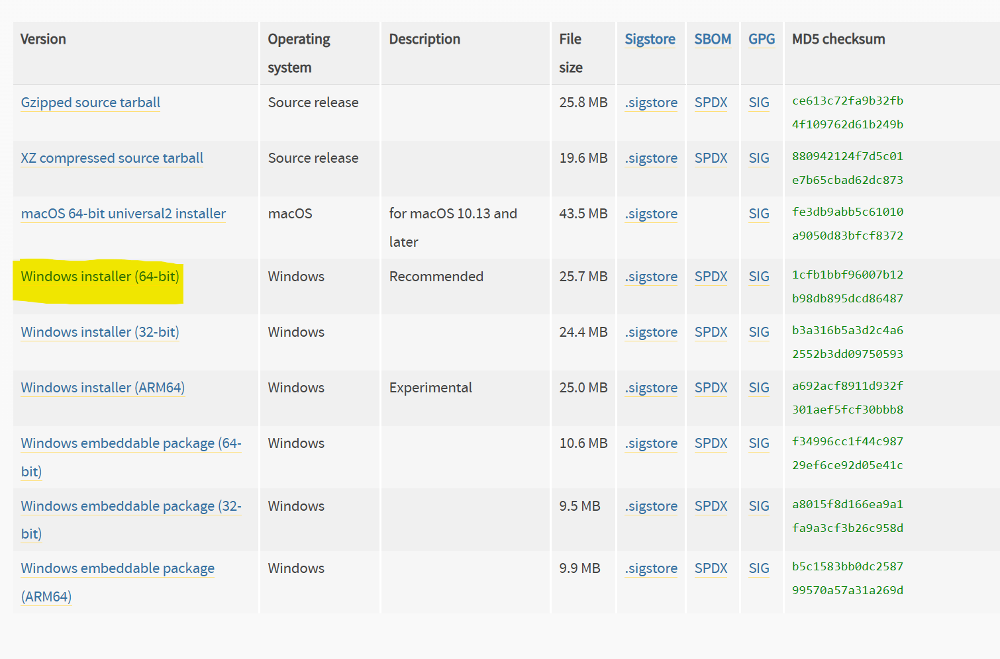

# Updating TAIPAN - A Practical Guide
This guide covers the most common maintenance tasks you’ll need to do on TAIPAN. It assumes you know basic Python but are **not** familiar with the TAIPAN codebase yet.
> **Before you start:** Make sure TAIPAN and all dependencies are set up on your machine. If not, follow the Installation Instructions in the main developer docs first.


-----
## Table of Contents
1. [Onboarding new users](#0-onboarding-new-users)
1. [Project Structure - Where is Everything?](#1-project-structure--where-is-everything)
1. [Adding a New Station or Location](#2-adding-a-new-station-or-location)
1. [Adding a New Script or Feature](#3-adding-a-new-script-or-feature)
1. [Adding a New Button to the Launcher](#4-adding-a-new-button-to-the-launcher)
1. [Adding a New Python Library](#5-adding-a-new-python-library)
1. [Running the Test Suite](#6-running-the-test-suite)
1. [Modifying existing functionality](#7-modifying-existing-functionality)
1. [Common Errors and Fixes](#8-common-errors-and-fixes)
1. [To be done or maintained](#9-to-be-done-or-maintained)
-----


## 0. Onboarding new users 

Before proceeding, make sure the laptop where TAIPAN is being installed is under "Dev Workstations Enforced" security group for Airlock. This can be requested from IT. 

### 1. Download Python 

- Go to [this link](https://www.python.org/downloads/release/python-3129/), scroll down, find the 64 bit windows installer. Click the version (displayed) below to install


    


- When the installer is finished, run it from your downloads folder. Leave everything as default and click skip/next.


### 2. Clone the repository OR Download the repository 


#### Cloning 
- Cloning is recommended so users can keep updated with files instantaneously rather than having to manually update the code files every time an update is pushed.
- For this method - you need to do two additional steps before you can proceed with Step 4.
> - Create a Github account (use QR email to sign up) 
> -  Download Github Desktop (from here https://desktop.github.com/download/)
- Clone the repository anywhere in a local drive (e.g any path starting with C:/). But there are rules:
> 1. DO NOT install TAIPAN into any network drives, this will slow down the code runtime significantly. 
> 1. DO NOT install TAIPAN into the Downloads folder...

#### Non cloning way (manual)

- To download: Code -> download zip
- Unzip the repository in a local drive (e.g any path starting with C:/). DO NOT install TAIPAN into any network drives, this will slow down the code runtime significantly. 


### 3. Downloading / Setup of IDE (skip if not developing)
- Install Visual Studio Code if needed 

### 4. Setup 

This step sets up the virtual environment and installs all dependencies. 
- Double click setup_TAIPAN (.bat file)
- Script works on both home and corp computers. The path to Python can also be specified manually.


### 4.1 If the setup script (step 4) crashes or fails - you will need to run the commands manually as specified below


**BUT BEFORE YOU DO** - try this fix -> ensure there are no spaces or brackets/special characters in the folder name that the code lives in. If you download twice it will automatically add a space + (1), (2) next to the filename which the set up script does not recognise. Then run the setup script again. 


 **Important**: For all commands, replace the `<username>` part with your own username (e.g r123456)


- Right click inside `Python_TTSummary` (the repository you just cloned/downloaded that contains images, src, tests, etc) and create a virtual environment:

    `C:\Users\<username>\AppData\Local\Programs\Python\Python312\python.exe -m venv venv`

- Activate the virtual environment

    `.\venv\Scripts\activate`

    After running the previous two steps, you see something that looks like the below image, note the green (venv) to the left of the folder structure. 


    

    If you don't see the green (venv)  **🚨 DO NOT CONTINUE WITH THE REST OF THE STEPS! 🚨**. Doing so may break your Python environment. 


- Install TAIPAN's Python packages to virtual environment:

    `.\venv\Scripts\python.exe -m pip install -r requirements.txt`

    Should see something that looks like this when it's finished; if you get that red error just ignore it and continue.

    


- Install pywin32 manually 

    `.\venv\Scripts\python.exe -m pip install pywin32-311-cp312-cp312-win_amd64.whl`

- Now tell Python this code is a 'package':

    `.\venv\Scripts\python.exe -m pip install -e .`


### 5. Run 🚀
This launches TAIPAN
- Double click launch_TAIPAN (.vbs file). It's normal for it to a take a minute to launch for the first time. 

## 1. TAIPAN Structure — Where is Everything?

The diagram below shows a simplified version of the new TAIPAN structure. Please note that modifying anything in blue will affect all of the output scripts.


|Folder       |What’s in it                                              |
|-------------|----------------------------------------------------------|
|`constants/` |Station names, yard locations, colours - shared everywhere|
|`core/`      |Common utilities used across majority of the scripts             |
|`converters/`|Format converters (HASTUS, ITOPS)                         |
|`first_last/`|First/last departure outputs                              |
|`gui/`       |All UI code — launcher, popups, etc.                      |
|`plans/`     |NGR daily plan and similar                                |
|`reports/`   |QA reports, trip counts, error checker                    |
|`rsx/`       |Functions that modify RSX files                      |
|`stabling/`  |Stabling count and balance outputs                        |
|`timetables/`|Public and working timetable outputs                      |
|`tests/`     |Unit tests                                                |

**Rule of thumb:** if something’s missing from an output, start in `constants/` — a lot of issues trace back there (a missing station/yard/etc).

-----
## 2. Adding a New Station or Location
This is the most common maintenance task. All location data lives in one place.

**File to edit:** `constants/locations.py`

**What to do:**
1. Open `constants/locations.py`
1. Find the `STATIONS_MASTER` dictionary
1. Add your new station following the same format as existing entries
1. Save the file — the change will automatically flow through to all scripts that use station data

> **Note:** If a station or yard is missing from any output (e.g. stabling count, public timetable), this is almost always the fix. **For yards specifically**, also check the `YARDS` constant in the same file. If it’s a new yard, add it there too with its capacity and train type (use `None` if unknown). If its not a station or yard, add it to `MISC_STATIONS` instead. 
-----


## 3. Adding a New Script or Feature
**Where to put it:**

Put new code in the folder that matches its purpose (see the project structure table above). For example, a new stabling report goes in `stabling/`, a new timetable output goes in `timetables/`.

**Tips:**
- If your script needs to parse an RSX file, use the existing `xml_parser.py` in `core/` - don’t write your own parser. The `TrainInfo` object it returns has all the common train attributes already normalised. Further in this section will be an example of how to use this functionality.
- If you need a popup or file input dialog, use the standard functions in `gui/base` rather than writing your own. This keeps the UI consistent.
- If your GUI is specific to one script, add a new file in `gui/` rather than modifying `gui/base`.

**After adding a new script:**
- Add a button for it (see Section 4 below)
- Add unit tests for it if required (see Section 6 below)
- If it uses new libraries, update `requirements.txt` (see Section 5 below)


### 1.  How to use `parse_rsx` and `TrainInfo`
This is the starting point for almost every script in TAIPAN. These functions go through the RSX file and return what is requested in a readable, compact format. 
Here’s a minimal example that parses the RSX and returns lists of useful info:

```python
from taipan.core.xml_parser import parse_rsx

root, trains, d_list, u_list, run_dict, _ = parse_rsx(
   path, # must specify yourself 
   want_trains=True,
   want_days=True,
   want_units=True,
   want_runs=True
)

for train in trains:
    # for every train in the RSX it prints the their (weekday, train type, destination). 
    # You can get more attributes using `Traininfo` attribute cheat sheet further down
   print(train.weekday, train.train_type, train.is_empty)
```

**Return values:**
|Variable    |What it is                                                     |
|------------|---------------------------------------------------------------|
|`root`      |Raw XML root element of the RSX file                           |
|`trains`    |List of `TrainInfo` objects - one per train                    |
|`d_list`    |List of day codes found in the RSX (e.g. `['120', '64', '32']`)|
|`u_list`    |List of unit types found in the RSX (e.g. `['NGR', 'QMU']`)    |
|`run_dict`  |Dictionary of runs keyed by `(run, weekday)`                   |
|`duplicates`|List of duplicate train numbers detected                       |

**`want_` flags:**
|Flag                  |What it does                                                          |
|----------------------|----------------------------------------------------------------------|
|`want_trains=True`    |Parses all trains into `TrainInfo` objects — required for most scripts|
|`want_days=True`      |Builds `d_list`                                                       |
|`want_units=True`     |Builds `u_list`                                                       |
|`want_runs=True`      |Builds `run_dict`                                                     |
|`want_duplicates=True`|Checks for duplicate train numbers                                    |


**`TrainInfo` attribute cheat sheet:**
|Attribute                  |What it gives you                                                          |
|---------------------------|---------------------------------------------------------------------------|
|`train.weekday`            |Day code (e.g. `'120'` for Mon–Thu)                                        |
|`train.unit`               |Train type (e.g. `NGR`, `QMU`, `IMU`)                                      |
|`train.train_type`         |Full normalised type string (e.g. `6-NGR`, `Empty_3-QMU`)                  |
|`train.is_empty_train`     |`True` if the train is running empty                                       |
|`train.cars`               |Number of cars (`3` or `6`)                                                |
|`train.stations`           |List of station IDs in order                                               |
|`train.origin`             |First entry attributes (station, departure time etc.)                      |
|`train.destin`             |Last entry attributes                                                      |
|`train.odep` / `train.ddep`|Origin and destination departure times                                     |
|`train.sector`             |Sector number as an integer                                                |
|`train.start_id` / `train.end_id `| station ID of origin/dest                                            |
|`train.run`                |Run ID                                                                     |
|`train.lineID`             |Full line ID from RSX                                                      |
|`train.number`             |Train number                                                               |
|`train.direction`          |`'Up'` or `'Down'`                                                         |
|`train.connection`         |Connection element if present, else `None`                                 |
|`train.vyst_is_yard`       |`True` if VYST is treated as a yard for this run (temporary - see  main dev docs)|

Note: 
- The prefix will be what you named it: e.g if you did for t in trains - the attributes above will be be t.weekday, t.unit and so on...
- You can add more to this! See core/xml_parser.py `TrainInfo` class.


### 2. Get it ready to integrate with new buttons!

Let's say you need to create a new script that:
1. Takes an input RSX, from the user
1. Prints all the origin and destinations station IDs for each trainID
1. Pops up a message box of (trainID, origin, and destination)

From the previous section we can come up with something like this - but with a few important additions.

```python
from taipan.core.xml_parser import parse_rsx
from taipan.gui.base import select_file, show_info_scroll_safe # import existing UI elements
from PyQt6.QtWidgets import QApplication
import sys

def get_od_of_trains(path, mypath = None):

    root, trains, d_list, u_list, run_dict, _ = parse_rsx(
    path,
    want_trains=True,
    want_days=True,
    want_units=True,
    want_runs=True
    )

    train_list = []


    for train in trains:
        train_list.append(f"{train.number}, {train.start_id}, {train.end_id}")
        print(train.number, train.start_id, train.end_id)

    train_msg = "\n".join(train_list)
    
    
    show_info_scroll_safe("Trains, origin and destination: ", train_msg) # must use *safe versions to ensure it works with the UI 

if __name__ == "__main__":
	app = QApplication.instance() or QApplication(sys.argv) # this ensures we can still run this function standalone - without using the full UI 
	path = select_file(caption='Select RSX file',directory='',filter_str='RSX Files (*.rsx);;All Files (*.*)') 
	if path:
		get_od_of_trains(path)
```


-----

## 4. Adding a New Button to the Launcher
In this example, we will create a new button that runs the code from #2 in the previous section.
The launcher UI is in `gui/launch.py` and the button configuration lives in `gui/ui_constants/names.py`.

**Step 1 — Load your function (lazily) at the top of launch.py**


```python
# find this section in launch.py
TTS_ERR         = _lazy("taipan.reports.ErrorChecker",           "TTS_ERR")
TTS_PTT         = _lazy("taipan.timetables.PublicTimetable",     "TTS_PTT")
... 
TTS_OD          = _lazy("taipan.test", "get_od_of_trains") # add new import
```

**Step 2 — Add the function to the `TaipanLauncher` class in `launch.py`**
In `gui/launch.py`, add a new method to the `TaipanLauncher` class. This function is what gets called when the button is clicked. 
Going off our previous example:

```python
class TaipanLauncher(QMainWindow):
    ...
    ...

    def _run_qa(self, button=None):
        path = self.get_file(filter_str="RSX Files (*.rsx)")

        if not path:
            return

        self.run_task(lambda: TTS_ERR(path),"● RUNNING — QA / ERROR CHECKER...","● DONE — QA / ERROR CHECKER")


    def _run_OD(self, button = None):
        path = self.get_file(filter_str="RSX Files (*.rsx)") # you can also add force_new = True if you want it to force a new selection each time rather than using saved file

        if not path:
            return

        self.run_task(lambda: TTS_OD(path),"● RUNNING — OD...","● DONE — O/D LIST")
```

**Step 3 — Register the button**

Open `gui/ui_constants/names.py` and find the `groups` dictionary within `SCRIPTS`. Add your button to the appropriate category using this format:

```python
("Get Origin/Dest", "_run_OD", "Gets origin and destination of each train in the RSX.")
```
The three values are: button label, function name (must match what you defined in the class, in our example it was `_run_OD`), tooltip text.


> **Important:** If your script has no clear exit point (e.g. it opens a dashboard that stays open), run it as a subprocess instead. See the `_run_runtime` function in `launch.py` for an example of how to do this.

> **Threading note:** The UI is multi-threaded. Never call a Qt widget directly from inside your function — this will crash the app. If you see `QObject: Cannot create children for a parent that is in a different thread`, this is why.

> **COM/win32 note:** If your function uses COM or win32 and it freezes or crashes, add `pythoncom.CoInitialize()` at the top of your function and `pythoncom.CoUninitialize()` in a `finally` block.


**Step 4 — Test it**

Launch TAIPAN (`launch_TAIPAN.bat` or just run the launch code within your IDE) and confirm your button appears and works. Styling of the buttons and UI more generally can be modified via `gui/ui_constants/stylesheet.py` (uses CSS).

-----


## 5. Adding a New Python Library
Whenever you install a new library via pip, you **must** update `requirements.txt` so TAIPAN can be updated correctly for everyone else.

**Steps:**
1. Install your library normally: `.\venv\Scripts\python.exe -m pip install <library-name>`
1. Run the following to regenerate `requirements.txt`:

  ```
  .\venv\Scripts\python.exe -m pip freeze > requirements.txt
  ```
3. Open `requirements.txt` and **DELETE any lines** related to `pywin32` that don’t have a pinned version number (lines that look like `pywin32==` with nothing after the `==`, or lines without `==` at all). See below - this is how it might look...
```
# DELETE THESE LINES!
-e c:\python_ttsummary
pywin32 @ file:///C:/Users/r919150/Downloads/pywin32-311-cp312-cp312-win_amd64.whl#sha256=b8c095edad5c211ff31c05223658e71bf7116daa0ecf3ad85f3201ea3190d067
```
4. Commit the updated `requirements.txt`

> Others on the team will pick up the new dependency automatically when they run `update_TAIPAN.bat` after pulling the new requirements file.
-----
## 6. Running the Test Suite
Always run the tests after making changes to make sure you haven’t broken anything.
**To run all tests, paste this into your terminal from the TAIPAN root folder:**
```
.\venv\Scripts\python.exe -m pytest
```
You should see all tests passing. Currently there are 66 tests.

**To add new tests:**
1. Create a new file in the `tests/` folder
1. pytest will automatically discover and run it - no extra configuration needed
1. Write tests for any new functionality you add

-----
## 7. Modifying existing functionality 
This section will help you make simple modifications to existing scripts.

#### Adding a new check to QA 


1. Open up `ErrorChecker.py` and write your check anywhere above the `TTS_ERR` function. 

    In this example we want to find all runs that start or end at non stabling locations. 

    ```python

    def check_stabling(run_dict, stable_locations, weekday_keys):
        # check if any runs start or end at non stable locations 
        issues = []
        for key, rec in run_dict.items():
            run, weekday = key
            day = weekday_keys.get(weekday, {}).get('short', weekday)
            if rec[3] not in stable_locations:
                issues.append(f'Run {run} on {day} starts at {rec[3]}')
            if rec[4] not in stable_locations:
                issues.append(f'Run {run} on {day} ends at {rec[4]}')
        return issues

    ```

2. Go to the `TTS_ERR` function and call your function in the run checks section. Keep in mind - these input arguments come from the `TrainInfo` class. 

    ```python

    stablingissue = check_stabling(run_dict, stable_locations, WEEKDAY_KEYS_MASTER)

    ```

3. Find the `sections = [...]` list within `TTS_ERR`. Add it as a new section and it will appear in the output file if that check is detected from the input RSX. 

    ```python

    sections = [
		('Runs starting/ending at non-stabling locations',      stablingissue),
        ... ]

    ```

    Note: Section list also supports subsections. In this example we could also make our `check_stabling` function return two lists - `starting_runs` and `ending_runs` to display it separately in a subsection. 

    Then we would just update our sections dict like this - this will create two subsections under the parent section. 

    ```python

    sections = [
		('Runs starting/ending at non-stabling locations',  {
				'Runs starting at non stabling': starting_runs,
				'Runs ending at non stabling': ending_runs
		}),

        ... ]

    ```

#### Changing terminating stations in TripCount

If you need to alter the destination station in a line; e.g for Shorncliffe count trips ending at SGE instead of SHC - modify the following data structures. 

```python
    # remove SHC 
    uniquestations_dict = {
            ...
            'Shorncliffe':                ('BHA','BQY','BQYS','NUD','BZL','NBD','DEG','SGE'),
            ...
            }

    
    vrt_2Shorncliffe = {
            #'SHC':     (19, 2290),
            'SGE':     (18, 2025),
            'DEG':     (17, 1586),
            'NBD':     (16, 1499),
            'BZL':     (15, 1422),
            'NUD':     (14, 1261),
            'BQY':     (13, 1182),
            'BQYS':    (12, 1740),
            'BHA':     (11, 1106),
            'NTG':     (10, 1350), 
            'NND':     (9,  903),
            'TBU':     (8,  834),
            'AJN':     (7,  800),
            'EGJ':     (6,  714), 
            'WWI':     (5,  631),
            'AIN':     (4,  551),
            'BHI':     (3,  520),
            'BRC':     (2,  299),
            'BNC':     (1,  149),
            'RS':      (0,  0)
            }

        findtrips('Shorncliffe',        ['NTG', 'SGE']) # change SHC to SGE - only for terminating station case 
```
FYI - the virtual runtime dictionaries are only useful for categorising trains *that do not touch the CBD* into peak, offpeak, etc.  
For finding direction/line, prefer using t.direction from the `TrainInfo` class or obtaining related information from the master stations dict...

#### Adding new things! 

1. New Train type or weirdly formatted train type in RSX you'd like to be recognised + standardised in any of the script's output files?
- New train type - modify `SORT_ORDER_UNIT` in `trains.py`. 
- Weirdly formatted train type - modify `TRAIN_TYPE_MASK`in `trains.py`. Just add a new entry in the order (whats in rsx, what it should be recognised as)

```python
TRAIN_TYPE_MASK = {
    'empty_6-rep': 'Empty_6-QMU',
    '6-rep': '6-QMU',
    '6-qmu_(aw0)_surface': 'Empty_6-QMU',
    '6-qmu_(aw3)_surface': '6-QMU',
    '6-ngr_(aw0)_surface': 'Empty_6-NGR',
    '6-ngr_(aw3)_surface': '6-NGR',
    'qmu_s': '6-QMU',
    'empty_qmu_s': 'Empty_6-QMU',
    '6-ngr_s': '6-NGR',
    'empty_6-ngr_s': 'Empty_6-NGR',
    'ngr_s': '6-NGR',
    'cool_train': 'Empty_9-QMU' # (what is in RSX field, what it should be standardised to)
}
```

#### RSX to UTC - ignoring stations in output 

1. Ignoring stations - add to `IGNORE_STATIONS` list in `convert_RSX_UTC.py`. Will apply to both passenger and freight trains. 


#### Updating tooltips 

Open `gui/ui_constants/names.py` and find the `groups` dictionary within `SCRIPTS`. The tooltips are read from the last index - so updating "Gets origin and destination of each train in the RSX" will change the tooltip for that particular button.

```python
("Get Origin/Dest", "_run_OD", "Gets origin and destination of each train in the RSX.") 
```

-----
## 8. Common Errors and Fixes
|Error                                                                       |What it means                                 |Fix                                                                                                            |
|----------------------------------------------------------------------------|----------------------------------------------|---------------------------------------------------------------------------------------------------------------|
|Station/yard missing from output                                            |Station not in `STATIONS_MASTER`              |Add it to `constants/locations.py`                                                                             |
|`QObject: Cannot create children for a parent that is in a different thread`|Qt widget called directly from worker thread  |Don’t call UI elements from inside your tool function                                                          |
|COM/win32 function freezing or crashing                                     |COM object not initialised on the right thread|Add `pythoncom.CoInitialize()` at the top of the function and `pythoncom.CoUninitialize()` in a `finally` block|
|New library not found on someone else’s machine                             |`requirements.txt` not updated                |Run `pip freeze > requirements.txt`, remove unversioned pywin32 lines, commit                                  |                                                          |
| Taipan hangs / not launching / extremely slow to launch / venv creation on install stuck | I have no idea | Restart laptop and test by running a fast script (e.g QA). If its still hanging restart again. When I encountered this I restarted 3x. 
| Setup script not working | Script likely doesnt recognise your file path | Rename the folder -  remove all spaces and special characters. Run set up again and ensure the entire path has no special characters or spaces. 
| CORTEX starts up when launching TAIPAN and blocks everything | You downloaded TAIPAN into the Downloads folder | You can use launch_taipan_dev or move it elsewhere. VBS scripts are not allowed to run out of the Downloads folder. 


-----

## 9. To be done or maintained

- Train renamer (`train_renamer.py`) has to be updated for new destination station ranges 
- `run_renamer_new.py RANGES` dict should be updated once new unit ranges are known.
- `MISC_LOCATIONS` in `locations.py` most likely needs additions - I just added locations as I gradually found them throughout the scripts but might not be comprehensive.
- If TAIPAN gives a permmission denied error - it means a file with the same name is open in Excel. All scripts that output Excel files should probably guard against this by closing any Excel files with the same name as the output before writing - I believe only StablingCountStepGraph has this guard. 


*For deeper technical detail on any of the above, refer to the main developer docs on the main Git page.*
